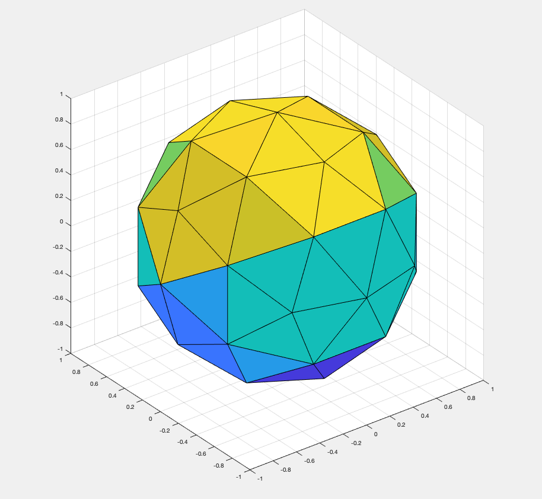
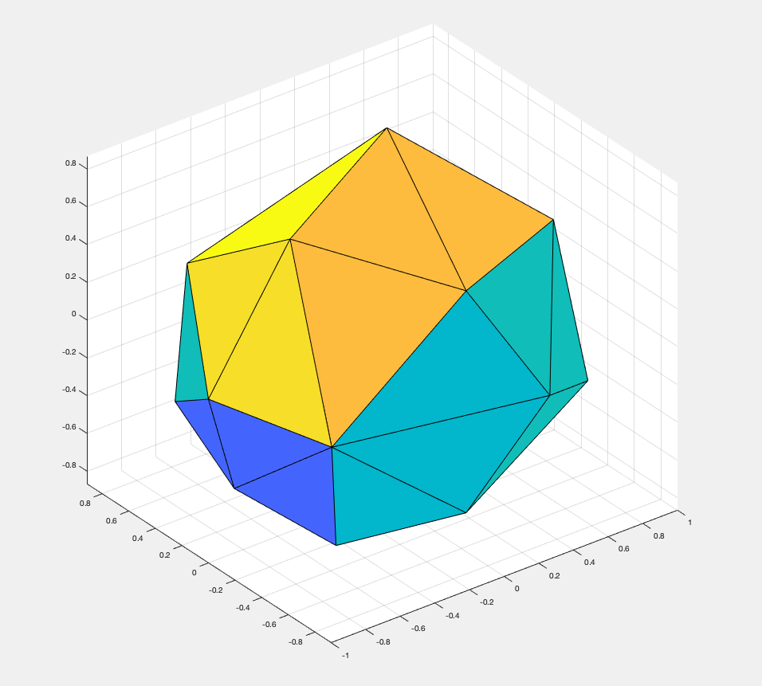

# Installing gptoolbox

In this part of the tutorial we will install the gptoolbox library and make
sure that it runs correctly.
There are no exercises in this part of the tutorial.


## Downloading gptoolbox and adding it to the search path

Download the current gptoolbox from its
[github repository](https://github.com/alecjacobson/gptoolbox), and put it
at a persistent path in your operating system.
We'll call this path `GPTOOLBOX_PATH`.

There are two ways for you to do this.
If you are unfamiliar with git and github, then simply click on the green
`code` button [here](https://github.com/alecjacobson/gptoolbox), then click
on `Download ZIP`, download the gptoolbox library and unpack it somewhere in
your system.
Remember where you put it:
the file path of the folder you downloaded
(which should look like `/[...]/gptoolbox` on Mac/Linux, or
`C:\[...]\gptoolbox` on Windows) is your gptoolbox path, henceforth called
`GPTOOLBOX_PATH`.
If you are familiar with git and github, then simply clone the
[gptoolbox git repository](https://github.com/alecjacobson/gptoolbox).

On the surface level, gptoolbox is simply a collection of MATLAB files.
The only thing that is needed to install the gptoolbox library is to add all
of its folders to the search path of your MATLAB installation.
This is done with the following three commands:
```MATLAB
>> gp_subdirs = split(genpath('GPTOOLBOX_PATH'),':');
>> addpath(strjoin(gp_subdirs(~contains(gp_subdirs,'.git')),':'));
>> savepath;
```
Make sure to replace `GPTOOLBOX_PATH` with the location where you downloaded
gptoolbox.
I installed it in `~/lib/gptoolbox`, so my first command is
```MATLAB
>> gp_subdirs = split(genpath('~/lib/gptoolbox'),':');
```

Restart your MATLAB.
We will now check whether gptoolbox was installed correctly.
Try issuing the following commands:
```MATLAB
>> [V,F] = subdivided_sphere(1);
>> tsurf(F,V); axis equal;
```

If everything worked correctly, you should be greeted with the plot of an
_icosphere_ (a sphere that is a subdivided
[icosahedron](https://en.wikipedia.org/wiki/Icosahedron)).


Congratulations!
You have installed gptoolbox and it is working.
If any of this did not work correctly, please contact the course organizer now.
It will be difficult to continue the course without making sure this basic step
works.


## Compiling the MEX functions (Optional until exercise 205)

gptoolbox contains certain functions that are _MEX functions_, consisting of
`C++` code that has to be compiled into code that can then be used as a normal
function in MATLAB.
This is done for multiple reasons, such as improved performance, and
availability of some algorithms as a `C++` implementation.
Compiling these functions is optional.
This course does not require the use of any of these functions.
If you want to take advantage of all of gptoolbox's capabilities, however, you
might want to install these MEX functions.

A detailed guide for the installation of gptoolbox's MEX components is
available [here](../205_mex/compilation_instructions.md).
This document contains a very brief overview.
Please follow the link and install MEX if you want to be able to use these
optional features.

After the MEX files have been compiled, try issuing the following command:
```MATLAB
>> [V,F] = subdivided_sphere(1);
>> [V,F] = decimate_libigl(V,F,0.5);
>> tsurf(F,V); axis equal;
```
If everything worked correctly, you should be greeted by a decimated
icosphere.


If these steps did not work, please refer to
[this page](https://github.com/alecjacobson/gptoolbox/tree/master/mex)
for further troubleshooting.

